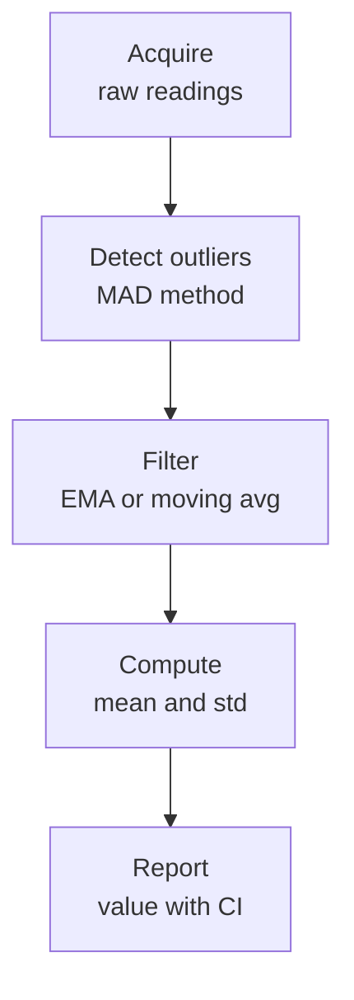

import AppliedMathematicsComments from '../../../../components/applied-mathematics/AppliedMathematicsComments.astro';
import TawkWidget from '../../../../components/TawkWidget.astro';
import UniversalContentContributors from '../../../../components/UniversalContentContributors.astro';
import InArticleAd from '../../../../components/InArticleAd.astro';
import Copyright from '../../../../components/Copyright.astro';
import BionicText from '../../../../components/BionicText.astro';
import TailwindWrapper from '../../../../components/TailwindWrapper.jsx';
import { Tabs, TabItem } from '@astrojs/starlight/components';
import { Card, CardGrid, Badge, Steps, LinkButton, FileTree } from '@astrojs/starlight/components';

<UniversalContentContributors 
  contributors={frontmatter.contributors}
/>


Every sensor reading is a lie. Not a big lie, usually, but a lie nonetheless. The temperature is not exactly 23.7 degrees. The distance is not exactly 1.42 meters. Every measurement carries noise, tiny random errors that come from thermal fluctuations, electrical interference, quantization, and a dozen other sources you cannot eliminate. This lesson teaches you to live with noise, to quantify it, filter it, and state honestly how much you trust your numbers. #Probability #Statistics #SignalProcessing

## Mean and Variance: What Are Your Numbers Telling You?

You read a temperature sensor 100 times. You get 100 slightly different numbers. What is the temperature?

The **mean** (average) is the simplest answer:

$$\bar{x} = \frac{1}{N}\sum_{i=1}^{N} x_i$$

But the mean alone tells you nothing about the quality of your data. Did all 100 readings cluster tightly around 23.5, or did they scatter wildly from 20 to 27? That is what **variance** measures: the average squared deviation from the mean.

$$\sigma^2 = \frac{1}{N}\sum_{i=1}^{N} (x_i - \bar{x})^2$$

The **standard deviation** $\sigma$ is the square root of variance. It has the same units as your data, which makes it more intuitive. If your temperature readings have a mean of 23.5 and a standard deviation of 0.3, that tells you most readings fall within about 0.3 degrees of the mean.

### Why Variance Uses Squared Deviations

Why not just average the deviations? Because positive and negative deviations cancel out. A dataset with values [20, 27] and another with [23, 24] both have the same mean (23.5), but the first has far more spread. Squaring the deviations makes them all positive and penalizes large deviations more heavily.

### Sample vs. Population

When you compute variance from a sample (which is almost always), you divide by $N-1$ instead of $N$:

$$s^2 = \frac{1}{N-1}\sum_{i=1}^{N} (x_i - \bar{x})^2$$

The reason: your sample mean is already optimized to minimize the sum of squared deviations from itself. Dividing by $N$ underestimates the true variance. Dividing by $N-1$ corrects this bias. For large $N$, the difference is negligible. For small samples, it matters.

## The Gaussian Distribution: Why It Shows Up Everywhere

<InArticleAd />


The bell curve, the normal distribution, the Gaussian: it is the most important probability distribution in engineering. If your temperature sensor noise is Gaussian with mean $\mu$ and standard deviation $\sigma$, the probability density is:

$$p(x) = \frac{1}{\sigma\sqrt{2\pi}} \exp\left(-\frac{(x-\mu)^2}{2\sigma^2}\right)$$

Why does the Gaussian show up everywhere? Because of the **Central Limit Theorem**: if you add up many small, independent random effects, the total is approximately Gaussian, regardless of how the individual effects are distributed. Sensor noise is the sum of thermal noise, amplifier noise, quantization error, and interference. Each is small, each is independent, and their sum is Gaussian. This is not a coincidence. It is a mathematical inevitability.

### The 68-95-99.7 Rule

For a Gaussian distribution:
- **68%** of readings fall within $\pm 1\sigma$ of the mean
- **95%** of readings fall within $\pm 2\sigma$ of the mean
- **99.7%** of readings fall within $\pm 3\sigma$ of the mean

This gives you a practical way to spot problems. If a reading is more than $3\sigma$ from the mean, there is less than a 0.3% chance it is just noise. Something else is going on.

Weather forecasts use this same thinking. When a forecast says "70% chance of rain," it means the model predicted rain in 7 out of 10 historically similar atmospheric conditions. It is not a guess; it is a probability derived from data.

### Histograms: Seeing Your Distribution

A histogram bins your data into ranges and counts how many readings fall in each bin. It is the visual form of a probability distribution.

```python
import numpy as np
import matplotlib.pyplot as plt

# Simulate 1000 noisy ADC readings (12-bit ADC, true value 2048)
np.random.seed(42)
true_value = 2048
noise_std = 15  # ADC counts
readings = true_value + noise_std * np.random.randn(1000)

# Compute statistics
mean = np.mean(readings)
std = np.std(readings, ddof=1)  # ddof=1 for sample std

print(f"Mean: {mean:.1f} counts")
print(f"Std dev: {std:.1f} counts")
print(f"Min: {np.min(readings):.1f}, Max: {np.max(readings):.1f}")

# Plot histogram with Gaussian overlay
fig, ax = plt.subplots(figsize=(8, 5))
counts, bins, _ = ax.hist(readings, bins=40, density=True,
                           alpha=0.7, color='steelblue',
                           label='ADC readings')

# Overlay the Gaussian
x = np.linspace(mean - 4*std, mean + 4*std, 200)
gaussian = (1 / (std * np.sqrt(2 * np.pi))) * \
           np.exp(-0.5 * ((x - mean) / std)**2)
ax.plot(x, gaussian, 'r-', linewidth=2, label='Gaussian fit')

ax.set_xlabel('ADC Count')
ax.set_ylabel('Probability Density')
ax.set_title('Distribution of 1000 ADC Readings')
ax.legend()
ax.grid(True, alpha=0.3)
plt.tight_layout()
plt.show()
```

## Moving Average: The Simplest Filter

<InArticleAd />


If each individual reading is noisy, why not average several consecutive readings? That is the **simple moving average (SMA)**: replace each reading with the average of itself and its neighbors.

$$\text{SMA}_k = \frac{1}{M}\sum_{i=0}^{M-1} x_{k-i}$$

where $M$ is the window size. A window of 10 averages the last 10 readings. The noise goes down by a factor of $\sqrt{M}$, so a window of 100 reduces noise by a factor of 10.

### The Trade-off: Smoothing vs. Lag

There is no free lunch. A larger window gives smoother output but introduces **lag**. The averaged value responds slowly to real changes. If the temperature jumps suddenly, a 100-point moving average takes about 100 samples to catch up. This is the fundamental trade-off in all filtering: noise reduction costs response time.

```text
Raw signal:        ....../\./\.../\....\./\../\.....
                          ^
                      real change happens here

Moving average:    ............./~~~~~\...............
                                ^
                      filter responds here (delayed)
```

### Exponential Moving Average: A Better Trade-off

The **exponential moving average (EMA)** gives more weight to recent readings and less to old ones. Instead of a flat window, it uses exponentially decaying weights:

$$\text{EMA}_k = \alpha \cdot x_k + (1 - \alpha) \cdot \text{EMA}_{k-1}$$

where $\alpha$ is between 0 and 1. A small $\alpha$ (like 0.05) gives heavy smoothing. A large $\alpha$ (like 0.5) tracks changes quickly but smooths less.

The EMA is beautiful for embedded systems: you only need to store one value (the previous EMA), and the computation is a single multiply-add. No buffer of past readings needed.

Your phone's step counter uses a similar statistical filter. The accelerometer signal contains walking vibrations mixed with random hand movements, and the filter distinguishes the rhythmic pattern of steps from everything else.

### Weighted Moving Average

A generalization: give different weights to different readings in the window. A common choice is the **triangular** or **linear** weighting, where the most recent reading gets the most weight:

$$\text{WMA}_k = \frac{\sum_{i=0}^{M-1} w_i \cdot x_{k-i}}{\sum_{i=0}^{M-1} w_i}$$

with $w_i = M - i$. This is a middle ground between SMA (equal weights) and EMA (exponential weights).

### Python: Comparing Filters

```python
import numpy as np
import matplotlib.pyplot as plt

# Simulate a sensor reading: true signal + noise
np.random.seed(42)
N = 500
t = np.linspace(0, 10, N)

# True signal: slow sine wave with a step change
true_signal = 3 * np.sin(0.5 * t)
true_signal[250:] += 2  # step change at t=5

noise = 0.8 * np.random.randn(N)
noisy = true_signal + noise

# Simple moving average (window = 20)
window = 20
sma = np.convolve(noisy, np.ones(window)/window, mode='same')

# Exponential moving average (alpha = 0.1)
alpha = 0.1
ema = np.zeros(N)
ema[0] = noisy[0]
for i in range(1, N):
    ema[i] = alpha * noisy[i] + (1 - alpha) * ema[i-1]

plt.figure(figsize=(10, 6))
plt.plot(t, noisy, 'gray', alpha=0.4, label='Noisy signal')
plt.plot(t, true_signal, 'k--', linewidth=2, label='True signal')
plt.plot(t, sma, 'b-', linewidth=1.5, label=f'SMA (window={window})')
plt.plot(t, ema, 'r-', linewidth=1.5, label=f'EMA (alpha={alpha})')
plt.xlabel('Time (s)')
plt.ylabel('Sensor Reading')
plt.title('Comparing Moving Average Filters')
plt.legend()
plt.grid(True, alpha=0.3)
plt.tight_layout()
plt.show()
```

## Confidence Intervals: Honest Uncertainty

<InArticleAd />


Saying "the temperature is 23.5 degrees" sounds precise. But is it? A proper measurement report says: "the temperature is 23.5 plus or minus 0.3 degrees C (95% confidence)." That means: if we repeated this measurement procedure many times, 95% of the intervals we construct would contain the true temperature.

For Gaussian data, the 95% confidence interval for the mean is:

$$\bar{x} \pm 1.96 \cdot \frac{s}{\sqrt{N}}$$

Notice the $\sqrt{N}$ in the denominator. Take 4 times as many readings, and the confidence interval shrinks by half. This is the fundamental law of averaging: uncertainty decreases as $1/\sqrt{N}$.

```python
import numpy as np

# 50 temperature readings
np.random.seed(42)
readings = 23.5 + 0.4 * np.random.randn(50)

mean = np.mean(readings)
std = np.std(readings, ddof=1)
n = len(readings)
se = std / np.sqrt(n)  # standard error of the mean

ci_95 = 1.96 * se

print(f"Mean: {mean:.2f} C")
print(f"Std dev: {std:.2f} C")
print(f"Standard error: {se:.3f} C")
print(f"95% CI: {mean:.2f} +/- {ci_95:.3f} C")
print(f"Range: [{mean - ci_95:.2f}, {mean + ci_95:.2f}] C")
```

### When to Use t-distribution Instead

For small sample sizes (roughly $N < 30$), the Gaussian approximation is optimistic. Use the Student's t-distribution instead, which has heavier tails to account for the uncertainty in estimating $\sigma$ from few data points. Python's `scipy.stats.t` handles this automatically:

```python
from scipy import stats

# For small samples, use t-distribution
readings_small = np.array([23.2, 23.8, 23.1, 23.6, 23.9, 23.4, 23.7])
n = len(readings_small)
mean = np.mean(readings_small)
se = np.std(readings_small, ddof=1) / np.sqrt(n)

# 95% confidence interval using t-distribution
ci = stats.t.interval(0.95, df=n-1, loc=mean, scale=se)
print(f"Mean: {mean:.2f} C")
print(f"95% CI (t-distribution): [{ci[0]:.2f}, {ci[1]:.2f}] C")
```

## Outlier Detection: When to Throw Away a Reading

<InArticleAd />


Not all bad readings are noise. Sometimes a sensor glitches. A wire comes loose. A cosmic ray flips a bit. These produce outliers: readings that are far from the expected value.

### The 3-sigma Rule

The simplest outlier test: if a reading is more than $3\sigma$ from the mean, flag it. For Gaussian noise, this happens by chance less than 0.3% of the time.

### Median Absolute Deviation (MAD)

The mean and standard deviation are themselves sensitive to outliers. One massive spike pulls the mean toward it and inflates $\sigma$. A more robust approach uses the **median** (middle value, immune to outliers) and the **MAD**:

$$\text{MAD} = \text{median}(|x_i - \text{median}(x)|)$$

Flag readings where $|x_i - \text{median}| > 3 \times 1.4826 \times \text{MAD}$. The factor 1.4826 makes MAD consistent with standard deviation for Gaussian data.

```python
import numpy as np
import matplotlib.pyplot as plt

# Simulate sensor data with outliers
np.random.seed(42)
N = 200
clean = 25.0 + 0.5 * np.random.randn(N)

# Inject 5 outliers
outlier_idx = [23, 67, 112, 145, 178]
clean[outlier_idx] = [32, 15, 35, 12, 40]

data = clean.copy()

# Method 1: 3-sigma (sensitive to outliers)
mean = np.mean(data)
std = np.std(data)
mask_sigma = np.abs(data - mean) > 3 * std

# Method 2: MAD (robust)
median = np.median(data)
mad = np.median(np.abs(data - median))
threshold = 3 * 1.4826 * mad
mask_mad = np.abs(data - median) > threshold

fig, (ax1, ax2) = plt.subplots(2, 1, figsize=(10, 6), sharex=True)

ax1.plot(data, '.', color='steelblue', markersize=4)
ax1.plot(np.where(mask_sigma)[0], data[mask_sigma], 'ro', markersize=8,
         label=f'3-sigma outliers ({mask_sigma.sum()} found)')
ax1.axhline(mean, color='k', linestyle='--', alpha=0.5)
ax1.axhline(mean + 3*std, color='r', linestyle=':', alpha=0.5)
ax1.axhline(mean - 3*std, color='r', linestyle=':', alpha=0.5)
ax1.set_ylabel('Reading')
ax1.set_title('3-Sigma Method')
ax1.legend()
ax1.grid(True, alpha=0.3)

ax2.plot(data, '.', color='steelblue', markersize=4)
ax2.plot(np.where(mask_mad)[0], data[mask_mad], 'ro', markersize=8,
         label=f'MAD outliers ({mask_mad.sum()} found)')
ax2.axhline(median, color='k', linestyle='--', alpha=0.5)
ax2.axhline(median + threshold, color='r', linestyle=':', alpha=0.5)
ax2.axhline(median - threshold, color='r', linestyle=':', alpha=0.5)
ax2.set_ylabel('Reading')
ax2.set_xlabel('Sample Index')
ax2.set_title('MAD Method (Robust)')
ax2.legend()
ax2.grid(True, alpha=0.3)

plt.tight_layout()
plt.show()

print(f"3-sigma detected: {mask_sigma.sum()} outliers")
print(f"MAD detected: {mask_mad.sum()} outliers")
print(f"Actual outliers: {len(outlier_idx)}")
```

## Putting It All Together: A Sensor Data Pipeline

<InArticleAd />


In practice, you combine these techniques into a pipeline: acquire data, detect and remove outliers, filter the remaining data, compute statistics, and report with uncertainty.



<Steps>

1. **Acquire** raw sensor readings (buffer of N samples)

2. **Detect outliers** using MAD and remove them

3. **Filter** the cleaned data with an EMA or moving average

4. **Compute** mean and standard deviation of the filtered data

5. **Report** the measurement with a confidence interval

</Steps>

```python
import numpy as np

def sensor_pipeline(raw_readings, alpha_ema=0.1, confidence=0.95):
    """Process raw sensor data into a measurement with uncertainty."""
    from scipy import stats

    data = np.array(raw_readings, dtype=float)

    # Step 1: Outlier removal (MAD)
    median = np.median(data)
    mad = np.median(np.abs(data - median))
    if mad > 0:
        threshold = 3 * 1.4826 * mad
        clean = data[np.abs(data - median) <= threshold]
    else:
        clean = data

    # Step 2: EMA filter
    filtered = np.zeros(len(clean))
    filtered[0] = clean[0]
    for i in range(1, len(clean)):
        filtered[i] = alpha_ema * clean[i] + (1 - alpha_ema) * filtered[i-1]

    # Step 3: Statistics
    n = len(filtered)
    mean = np.mean(filtered)
    std = np.std(filtered, ddof=1)
    se = std / np.sqrt(n)

    # Step 4: Confidence interval
    t_crit = stats.t.ppf((1 + confidence) / 2, df=n-1)
    ci = t_crit * se

    removed = len(data) - len(clean)
    return {
        'mean': mean,
        'std': std,
        'ci': ci,
        'confidence': confidence,
        'n_original': len(data),
        'n_outliers': removed,
        'report': f"{mean:.2f} +/- {ci:.3f} ({confidence*100:.0f}% CI, "
                  f"{removed} outliers removed from {len(data)} readings)"
    }

# Example usage
np.random.seed(42)
raw = 23.5 + 0.4 * np.random.randn(100)
raw[17] = 30.0  # inject outlier
raw[82] = 15.0  # inject outlier

result = sensor_pipeline(raw)
print(result['report'])
```

## Exercises

<InArticleAd />


1. **Noise characterization.** Read an ADC 1000 times (or simulate it). Compute the mean, standard deviation, and plot a histogram. Does it look Gaussian? How would you test this formally?

2. **Filter comparison.** Generate a slowly varying sine wave with added Gaussian noise. Apply SMA with windows of 5, 20, and 50. Apply EMA with $\alpha$ values of 0.3, 0.1, and 0.02. Which combination gives the best balance of smoothing and responsiveness for your signal?

3. **Confidence interval scaling.** Take 10, 50, 200, and 1000 samples from the same noisy source. Compute the 95% confidence interval for each. Verify that the interval width scales as $1/\sqrt{N}$.

4. **Outlier injection.** Take 100 clean sensor readings and inject 3 outliers at random positions. Test whether the 3-sigma method and the MAD method both find all three. What happens if you inject 20 outliers instead of 3?

5. **Real-world pipeline.** Build a function that takes a stream of sensor readings (arriving one at a time) and maintains a running EMA with online outlier rejection. The function should reject any new reading that deviates from the current EMA by more than $k$ times the running standard deviation.

## References

<InArticleAd />


- Wasserman, L. (2004). *All of Statistics*. Springer. Concise and readable.
- NIST/SEMATECH e-Handbook of Statistical Methods. [itl.nist.gov/div898/handbook](https://www.itl.nist.gov/div898/handbook/)
- Smith, S. W. (1997). *The Scientist and Engineer's Guide to Digital Signal Processing*. Free online: [dspguide.com](http://www.dspguide.com/)


<InArticleAd />
<AppliedMathematicsComments />
<TawkWidget />
<Copyright />